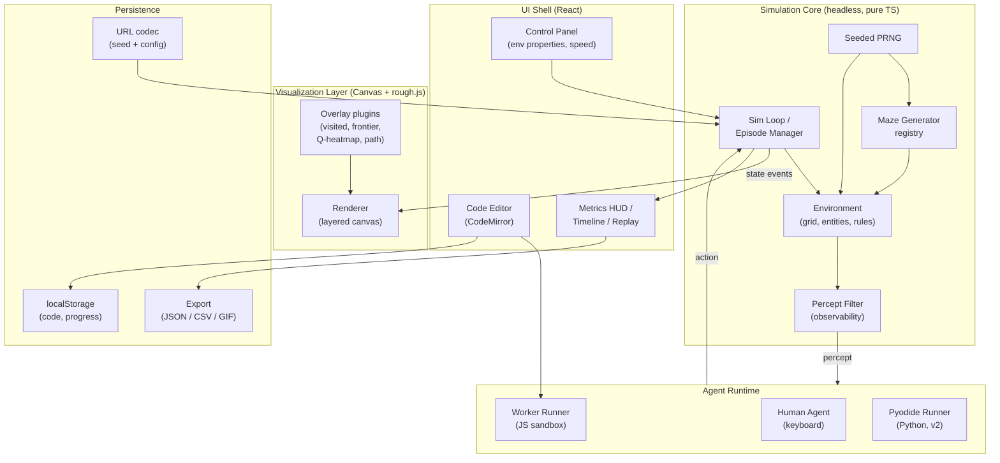
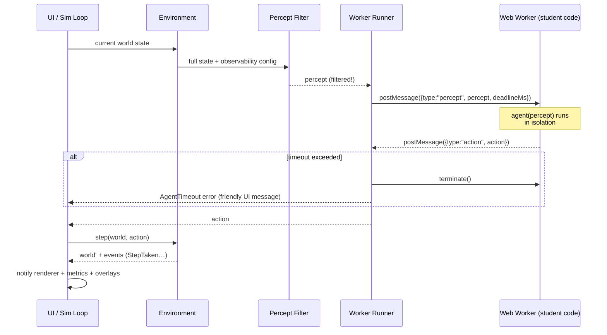

# Plarena · Search Arena — Architecture & Design Document

**An interactive sandbox for teaching AI agents, search, and reinforcement learning.**

- Status: **Historical design record, 2026-08-01.** The shipped implementation diverged
from this document: Plarena ships four hand-written single-file HTML apps with no build
stack. Kept for the reasoning and the vocabulary, not as a description of the code. For
what actually exists, read each arena's README.
- Date: 2026-08-01
- Name: **Search Arena**, the first lab of the **Plarena** suite (naming history: MazeLab → GridLab → Plarena/Search Arena)

---

## 1. Vision

Search Arena is a browser-based sandbox in which a small character navigates procedurally generated mazes. The environment itself is a *teaching instrument*: every classic property of an AI environment (observability, determinism, dynamics, number of agents) is an interactive toggle. Students can drive the character by hand, or hand control over to a program they write — an *agent function* in the exact textbook sense (percept in, action out).

One environment, many courses:

| Course | What Search Arena teaches |
|---|---|
| Algorithms | BFS / DFS / A* / Dijkstra; maze *generation* itself (randomized DFS, Prim, Kruskal, recursive division) |
| Artificial Intelligence | Agent architectures, environment properties (AIMA ch. 2), informed search, online search under partial observability (LRTA*), adversarial/multi-agent settings |
| Machine Learning | Q-learning / SARSA on gridworlds, exploration vs. exploitation, reward shaping |
| Data Mining | Trajectory datasets exported from runs (paths, visit counts) as material for clustering / pattern mining exercises |

**Product language is English only.** (Documentation may be bilingual; the app UI, API names, error messages, and level content are pure English.)

### Non-goals (v1)

- No backend, no accounts, no server-side code execution. The app is a static site.
- Not a general game engine. The core abstraction is a *discrete grid world*; anything expressible on a grid is in scope, real-time physics is not.
- Not an auto-grader (v1 exports metrics that a grader *could* consume; the grading pipeline itself is future work).

---

## 2. Design Principles

These five principles drive every structural decision below.

1. **Simulation ≠ Rendering.** The world simulation is a pure, headless, deterministic state machine. The renderer is a subscriber. This is what makes 10,000-episode RL training runs, replays, and unit tests possible.
2. **Percept-only information flow.** Agent code never touches world state; it receives exactly the percept the current observability setting allows. Partial observability is therefore *enforced by construction*, not by convention — students cannot cheat even deliberately.
3. **Determinism by seed.** All randomness (maze generation, stochastic actions) flows from one seeded PRNG. A `(seed, config)` pair fully reproduces a world — which makes assignments shareable as URLs and bugs reproducible.
4. **Everything is a plugin.** Maze generators, observability filters, agent runners, overlay visualizations, and entity types register themselves in registries. Adding "icy floor" or "patrolling ghost" must not require touching the core loop.
5. **Untrusted code stays in a Worker.** Student code runs in a Web Worker with a message protocol, hard timeouts, and no access to DOM or world state. Same model later extends to Python via Pyodide.

---

## 3. Personas & What Each Needs From the Architecture

### 3.1 Student (primary user)

- **Zero install.** Opens a URL, is moving the character with arrow keys within 10 seconds.
- **Gentle ramp.** Play by hand → watch a built-in demo agent → edit a 5-line template agent → write BFS from scratch.
- **Rich feedback.** Sees *why* the agent behaves as it does: visited cells, frontier, current percept highlighted, Q-value heatmaps. Errors from their code surface as friendly messages next to the editor, not a dead screen.
- **Safe failure.** Infinite loops get terminated with a clear "your agent timed out on step 42" message; the world never crashes.

### 3.2 Teacher (author & orchestrator)

- **Assignment = config + seed.** A lesson is a JSON config (environment properties, maze size, generator, metrics to display, starter code) encoded into a shareable URL. No content pipeline, no server.
- **Progressive disclosure controls.** Can lock toggles (e.g., force partial observability for an online-search assignment) so students face exactly the intended problem.
- **Projector mode.** Large-format rendering with keyboard shortcuts for live lectures: step one action at a time, toggle fog on/off mid-run to show the difference dramatically.
- **Metrics for assessment.** Steps taken, path cost vs. optimal, nodes expanded, episodes to convergence — exportable as JSON/CSV.

### 3.3 Engineer (you, contributors, future TAs)

- **TypeScript everywhere**, strict mode. The core interfaces (§6) are the contract; modules depend on interfaces, not implementations.
- **Testable core.** Headless simulation means the entire domain layer is unit-testable in Node (Vitest) with zero browser machinery.
- **Small, boring dependencies.** Vite + React + Zustand + rough.js + CodeMirror. No game engine, no heavy state framework.
- **Static deploy.** `vite build` → GitHub Pages / Netlify. CI runs typecheck + tests + build on every push.

### 3.4 Designer

- **A visual language, not just a skin.** Hand-drawn (Excalidraw-like) aesthetic rendered programmatically via rough.js — see §10 for why this is both the most charming and the *cheapest* option.
- **Motion as meaning.** Animation is reserved for pedagogy: the character hops cell-to-cell, fog dissolves when observability toggles, frontier cells pulse. Decorative motion is minimized.
- **Accessible by default.** Colorblind-safe palettes for overlays, full keyboard operation, reduced-motion mode.

---

## 4. Pedagogical Foundation: The Environment Property Matrix

The heart of the product. Each AIMA environment dimension is a first-class, independently togglable axis:

| Dimension | Toggle | v1? | Implementation sketch |
|---|---|---|---|
| Observable | Full / Partial (radius r) / Local (walls only) | ✅ v1 | Percept filter selects what world state enters the percept |
| Deterministic | Deterministic / Stochastic (action noise p) | v2 | Transition function samples from seeded PRNG |
| Static | Static / Dynamic (moving walls, patrols) | v2 | Entities with their own `step()` scheduled by the sim loop |
| Agents | Single / Multi (race or adversarial) | v3 | Multiple agent slots, turn-based scheduling |
| Episodic | Episodic / Sequential | ✅ v1 | Episode manager resets world, aggregates metrics |
| Discrete | Always discrete | — | Core assumption (grid world) |

The UI presents these as a physical-feeling **control panel** (§10), so "what kind of environment is this?" becomes something students *manipulate* rather than memorize.

**One search driver, five algorithms.** The built-in demo agent is a single generic search loop; BFS, DFS, Greedy best-first, Dijkstra, and A* differ only in how the frontier picks the next node (FIFO / LIFO / min-h / min-g / min-(g+h), ties toward larger g). Everything else — probe events, frontier/closed overlays, the probe tree, metrics — is shared, so switching algorithms is a dropdown and the *comparison* becomes the lesson. Measured on one hard (braided) maze, optimal = 44: BFS 44 steps / 247 expanded; Dijkstra identical to BFS on a unit grid (44/247) — itself a talking point; A* 44/146 (the heuristic's savings made visible); Greedy 52/125 (fast but suboptimal); DFS 76/201 (score 0.58). A* emits `update` (shorter-route-found) events when a queued node is re-parented, drawn distinctly in the animation. A **frontier data-structure panel** shows the algorithm's actual container live — FIFO queue (pops left), LIFO stack (pops right), or priority queue with per-element h/g/f values and the next-to-pop highlighted — making "BFS vs DFS is just queue vs stack" literally visible; hill climbing shows an empty panel (its flaw). The **heuristic is selectable** (Manhattan / Euclidean / Zero / custom JS expression) — Zero live-demonstrates A\* degenerating into Dijkstra (verified: identical expansion counts). The built-in demo agent is chosen via **algorithm buttons** (sample code hidden from students); a **"My code" mode** offers a code editor + file upload whose `agent(percept)` function actually drives the character step by step, with friendly crash/step-limit reporting — the mockup-level preview of the Worker-sandboxed agent API. A **magenta expansion-order trail** connects expanded nodes in the sequence the algorithm visited them (BFS sweeps levels; A* leaps between promising branches), and a **Full space** button renders the complete reachable state space at once — the one-picture argument for why heuristic search exists. **Terrain costs** (mud = 3, water = 5, seeded patches) make edges weighted — the moment UCS/Dijkstra stops being BFS and heuristic savings shrink to what the heuristic actually knows; metrics track path *cost* and optimal cost alongside steps. A **run-history strip** snapshots each completed run (algorithm, metrics, maze + tree thumbnails) so algorithms can be compared side by side on the same maze without re-running; history clears when the maze changes. Remaining next steps on the same seam: a weighted-A* slider (f = g + w·h continuously morphs Dijkstra → A* → Greedy), iterative deepening, and bidirectional search; the fog mode pairs with LRTA*/online search.

**Difficulty is a structural knob, not just size.** The generator is parameterized growing-tree: expanding the *newest* active cell yields DFS-style long corridors (easy); expanding a *random* active cell with probability *p* yields Prim-like branching (medium); a post-pass **braids** the maze by opening a fraction of dead-ends, creating loops (hard). Loops matter pedagogically: only a braided maze produces *real* repeated states during search (grey branches in the tree stop being trivia and become the reason the closed set exists), multiple solution routes (optimal vs. found path diverge), and larger frontiers. Easy/medium/hard is thus a tour of search-relevant graph structure, not a bigger grid.

---

## 5. System Architecture

### 5.1 Layer diagram



Dependency rule: **arrows of knowledge point inward.** `SIM` knows nothing about React, Canvas, or Workers. `AGT` implements a simulation-defined interface. `UI`/`VIZ` subscribe to simulation events. You could run the entire simulation in Node with a script — and the test suite does exactly that.

### 5.2 Module breakdown

```
src/
├── core/                  # Headless domain. Zero browser APIs.
│   ├── world.ts           # Grid, cells, entities, World state (immutable snapshots)
│   ├── transition.ts      # step(world, action) -> world' ; stochastic variants
│   ├── percept.ts         # PerceptFilter interface + full/partial/local filters
│   ├── episode.ts         # Episode lifecycle, termination, reset
│   ├── metrics.ts         # Pluggable metric collectors (steps, cost, expansions…)
│   ├── rng.ts             # Seeded PRNG (mulberry32 or similar)
│   └── events.ts          # Typed event bus (StepTaken, EpisodeEnded, …)
├── generators/            # MazeGenerator plugins
│   ├── dfs-backtracker.ts
│   ├── prim.ts
│   └── recursive-division.ts
├── agents/                # AgentRunner implementations
│   ├── human.ts           # Keyboard → action queue
│   ├── worker-runner.ts   # JS sandbox (protocol in §7)
│   ├── builtin/           # Demo agents via one generic search driver:
   │                      #   BFS / DFS / Greedy / Dijkstra / A* differ ONLY in
   │                      #   frontier policy (FIFO / LIFO / min-h / min-g / min-f)
│   └── pyodide-runner.ts  # v2
├── render/                # Canvas rendering
│   ├── renderer.ts        # Layer manager, dirty tracking, resize
│   ├── sketch.ts          # rough.js wrappers + shape cache
│   ├── character.ts       # Character sprite states & tweens
│   └── overlays/          # visited, frontier, heatmap, path, fog
├── ui/                    # React shell
│   ├── panels/            # ControlPanel, EditorPanel, MetricsPanel, Timeline
│   ├── modes/             # Play / Code / Watch / Projector
│   └── store.ts           # Zustand: UI state only (sim state lives in core)
├── persistence/
│   ├── url-codec.ts       # config+seed <-> URL hash (base64url of packed JSON)
│   └── storage.ts         # localStorage: student code, settings, progress
└── content/
    ├── lessons/*.json     # Lesson/assignment configs
    └── tutorial.ts        # Onboarding sequence definition
```

### 5.3 Data flow for one step



The Worker only ever sees percepts. Under partial observability the full maze never crosses the Worker boundary — cheating is structurally impossible, which is itself a talking point in lecture.

### 5.4 World model: block grid, not thin walls

Two classic maze representations exist: **thin walls** (an n×n grid of cells with wall flags on edges — the "pencil maze" look) and **block grid** (walls occupy whole cells; the world is a plain 2D array of FREE/WALL).

**Decision: the canonical internal model is the block grid.** Rationale, in teaching terms:

- The percept becomes a plain 2D array (`0 = free, 1 = wall`). Checking an obstacle is `maze[y][x] === 1` — exactly how gridworlds appear in AIMA, Berkeley Pacman, and every RL paper. With thin walls, students must instead reason through a `canMove(pos, dir)` edge API — an extra abstraction between them and the search algorithm.
- Search visualizations map 1:1 to cells: visited, frontier, and Q-value overlays paint the same cells the algorithm reasons about. Under thin walls, "the thing you test" (an edge) and "the thing you color" (a cell) are different objects — a persistent source of confusion.
- Fog of war is uniform: hiding a cell hides everything about it, walls included; a wall is knowledge you *acquire*, exactly like in the theory.

Thin-wall mazes are not lost: an n×n thin-wall maze converts losslessly to a (2n+1)×(2n+1) block grid (walls become cells), so generators can produce either and the world model stays uniform. A thin-wall *rendering* remains available as a display option (and the `canMove` view of the world can be offered in an advanced lesson — teaching that state-space representation is itself a design choice). Note the two representations differ in step counts (~2×), which is fine — they are genuinely different state spaces, and that too is teachable.

### 5.5 Fog is occlusion, not decoration

Rendering rule for partial observability: hidden cells are painted **opaque** — no wall geometry, goal marker, or entity may remain distinguishable underneath. The renderer must be tested for this (screenshot-diff: a hidden region renders identically regardless of the maze behind it). Fog that merely tints the maze would contradict the percept model the sandbox is built to teach.

Fog uses **memory semantics**: cells once observed stay revealed (the agent remembers its explored map — standard online-search bookkeeping). The *viewpoint* that reveals cells is the agent's position during manual play and the walk, and the **search head** (the node currently being expanded) during algorithm animation — so watching a search under fog shows the explored map growing outward, which is exactly what online exploration looks like.

---

## 6. Core Interfaces (the contract)

Kept deliberately small. These are the seams along which everything else can change.

```ts
// ---- World & actions ----
type Action = "UP" | "DOWN" | "LEFT" | "RIGHT" | "WAIT";

interface WorldConfig {
  width: number; height: number;
  seed: number;
  generator: string;              // registry key, e.g. "dfs-backtracker"
  observability: ObservabilitySpec;
  transition: TransitionSpec;     // { kind:"deterministic" } | { kind:"noisy", p:number }
  entities?: EntitySpec[];        // goals, keys, patrols… (extensible)
  episode: { maxSteps: number };
}

interface World {                  // immutable snapshot
  readonly config: WorldConfig;
  readonly grid: ReadonlyGrid;     // walls, cell contents
  readonly agentPos: Vec2;
  readonly entities: readonly Entity[];
  readonly t: number;              // step counter
}

// ---- The three plugin seams ----
interface MazeGenerator {
  id: string;
  generate(width: number, height: number, rng: RNG): Grid;
}

interface PerceptFilter<P = unknown> {
  id: string;                                   // "full" | "radius" | "local" | …
  makePercept(world: World): P;                 // the ONLY gate to agent knowledge
}

interface AgentRunner {
  id: string;                                   // "human" | "js-worker" | "pyodide" | "builtin:bfs"
  init(config: AgentInitConfig): Promise<void>;
  decide(percept: unknown, deadlineMs: number): Promise<Action>;
  dispose(): void;
}

// ---- Observation of the sim (renderer, metrics, overlays all subscribe) ----
type SimEvent =
  | { type: "world-reset"; world: World }
  | { type: "step"; world: World; action: Action; agentThought?: AgentTrace }
  | { type: "episode-end"; reason: "goal" | "max-steps" | "error"; metrics: MetricsSnapshot }
  | { type: "agent-error"; error: AgentError };

interface MetricCollector {
  id: string;
  onEvent(e: SimEvent): void;
  snapshot(): Record<string, number>;
}
```

`AgentTrace` is the optional channel by which an agent can report *introspection data* (e.g. its frontier, its Q-table) for visualization — the sandbox stays sealed for inputs, but agents may voluntarily publish their internals for the overlay system to draw. This one field is what makes "watch BFS think" possible.

### The student-facing API (what they actually write)

```js
// JavaScript (v1)
function agent(percept) {
  // percept.position   -> {x, y}
  // percept.goal       -> {x, y} | undefined  (hidden when unobservable)
  // percept.maze       -> 2D wall array        (full observability only)
  // percept.view       -> local (2r+1)^2 patch (partial observability only)
  // persistent state: use module-level variables — the worker lives
  // for the whole episode, so `let visited = new Set()` just works.
  return "UP";
}
```

```python
# Python via Pyodide (v2) — deliberately identical shape
def agent(percept):
    return "UP"
```

Design choices worth defending in class: the API *is* the AIMA agent-function definition; persistent worker = agent's internal state/memory; the percept schema literally changes shape when the environment toggles change — students *feel* the difference between environment classes in their code.

---

## 7. Sandboxing & Security Model

Threat model: student code is untrusted — buggy far more often than malicious, but treat both.

| Threat | Mitigation |
|---|---|
| Infinite loop / slow agent | Per-decision `deadlineMs` (default 50ms interactive, relaxed in batch mode); on breach → `Worker.terminate()` + recreate; error surfaced inline in editor |
| Reading hidden world state | Structurally impossible — Worker receives only the percept (§5.3) |
| DOM / network access from agent code | Workers have no DOM; additionally strip `fetch`/`XMLHttpRequest`/`importScripts` from worker global scope before eval |
| Memory bombs | Worker recreation per episode caps leak lifetime; optional `performance.memory` watchdog (best-effort) |
| Blocking the UI | All agent execution off-main-thread by design |

Batch/RL mode runs the same protocol with deadlines relaxed and rendering detached (§8), so the security model is uniform across modes.

---

## 8. Performance

Design targets: 60fps interaction at 51×51 mazes; ≥10k simulation steps/sec headless for RL episodes; first meaningful paint < 2s on campus Wi-Fi.

1. **Decoupled sim/render loop.** The sim emits events; the renderer coalesces them per animation frame. In fast-forward, the renderer drops to sampling (draw every Nth state + final); in headless batch it detaches entirely. This single decision is what makes Q-learning demos (thousands of episodes) feasible in-browser.
2. **Layered canvases.** Static maze layer drawn once per generation; fog layer redrawn only when visibility changes; overlay layer per-frame only when its data changed; character layer tweened. Rough.js shapes are cached as offscreen sprites per cell-type (hand-drawn jitter is *frozen per seed*, so caching is correct and the maze doesn't "boil").
3. **Cheap world snapshots.** Grid stored as typed arrays (`Uint8Array` walls); snapshots use structural sharing — only agent position & entity states copy per step. Replay = re-simulate from seed (worlds are deterministic), so we store *action logs*, not state history. A 10k-step run is a few KB.
4. **Worker messaging.** Percepts are small (partial observability: O(r²); full: one-time maze transfer + delta updates). Batch mode pipelines decisions without awaiting render.
5. **Bundle discipline.** Core app target < 300KB gzipped. Pyodide (~10MB) is lazy-loaded only when the student switches the language toggle to Python, with a clear loading state.

---

## 9. Scalability & Flexibility

Three distinct axes, three answers:

**Content scale** (more lessons, more classes): lessons are JSON + seed, hosted as static files or encoded in URLs. A teacher "deploys" an assignment by pasting a link into their LMS. No infrastructure grows with adoption — GitHub Pages serves 10 students or 10,000 identically.

**Feature scale** (the roadmap): the plugin registries are the extension points. Concretely, each planned v2/v3 feature maps to an existing seam — stochastic transitions (new `TransitionSpec`), dynamic entities (new `Entity` with `step()`), multi-agent (N agent slots in the sim loop, percepts already per-agent), Python (new `AgentRunner`), Wumpus World / Vacuum World / Pacman-style levels (new generators + entities on the *same* grid core — the "maze" app is secretly a gridworld engine). The mockup proves this seam with a second world, **City / ambulance run**: a rectangular-building generator with guaranteed street connectivity, an ambulance agent, and a hospital goal — every algorithm, overlay, and panel worked unchanged. A third world, **Vacuum / coverage mode**, changes only the goal test (all free cells visited) and ships a greedy nearest-frontier coverage agent that uses BFS as a subroutine — metrics show steps against the free-cell lower bound, introducing coverage path planning. It doubles as the demonstration that *heuristic informativeness depends on world structure*: A* beats BFS ~9× in expansions on open city grids (41 vs 365) versus ~1.7× inside mazes, because Manhattan distance is nearly exact on open ground and badly misled by walls.

**Team scale** (contributors, TAs, student projects): strict interfaces + headless-testable core means a student contributor can write a new maze generator or overlay as a self-contained file with tests, never touching the loop. This is itself a software-engineering teaching opportunity.

Future backend (optional, v4+): sharing gallery, classroom leaderboards, telemetry. Deliberately excluded from core architecture — everything above works without it, and it would attach at the persistence seam only.

---

## 10. UI & Engagement Design (designer's chapter)

### 10.1 Why hand-drawn — and why it's nearly free

Chosen direction: **hand-drawn / sketchbook** (Excalidraw-family aesthetic).

- *Pedagogical fit:* sketchy lines say "this is a whiteboard, experiment freely" — lowering the intimidation that a polished IDE-like tool carries. It visually matches how algorithms are actually taught (whiteboard drawings, Excalidraw diagrams students already know).
- *Distinctiveness:* edu-tools default to flat Material-style UI; a sketchbook world is memorable and screenshot-friendly (students sharing screenshots = organic adoption).
- *The cost objection is void:* rough.js generates hand-drawn-style shapes programmatically. Walls, character, buttons, panels — all drawn by code, zero art assets, infinitely re-themeable. Jitter seeds are fixed per world seed so visuals are stable (and reproducible!). One handwriting-adjacent font (e.g. *Patrick Hand*) for headings; a clean monospace for code and numbers — student code must never look sketchy, the contrast between "playful world" and "precise code" is the visual story of the whole product.

**Themes are render plugins.** Because the world is drawn programmatically from the block grid, a theme is just a set of draw functions (wall cell, floor, character, fog tile, goal) plus a CSS variable set. The mockup ships two — *hand-drawn* (rough.js) and *pixel/retro* (crisp rects, dark palette, sprite character) — switchable at runtime with sim state intact, proving the seam. Hand-drawn stays the default personality of the product; pixel mode is a fun classroom variety knob and a demonstration that the render layer owes nothing to the sim.

### 10.2 Layout

```
┌──────────────────────────────────────────────┬────────────────────┐
│  Search Arena   [Play] [Code] [Watch]   seed#4213 │  ENVIRONMENT       │
│ ┌──────────────────────────────────────────┐ │  ┌─ Observability ─┐│
│ │                                          │ │  │ ● Full          ││
│ │              MAZE CANVAS                 │ │  │ ○ Partial (r=2) ││
│ │        (character, fog, overlays)        │ │  │ ○ Walls only    ││
│ │                                          │ │  └─────────────────┘│
│ │                                          │ │  Determinism ▓▓░ 0.8│
│ └──────────────────────────────────────────┘ │  Generator  [DFS ▾] │
│  ⏮  ◀ step   ▶ play   ⏩ fast   🔁 regen     │  Size       [21×21] │
├──────────────────────────────────────────────┤  ─────────────────  │
│  ┌ CODE (JS ▾) ────────────┐ ┌ METRICS ────┐│  OVERLAYS           │
│  │ function agent(percept){ │ │ steps    47 ││  ☑ visited ☐ frontier│
│  │   ...                    │ │ optimal  31 ││  ☐ heatmap ☑ path   │
│  │ }              [▶ Run]   │ │ expanded 210││                     │
│  └──────────────────────────┘ └─────────────┘│  [Share link 🔗]    │
└──────────────────────────────────────────────┴────────────────────┘
```

Three modes, one layout: **Play** (keyboard control, editor hidden), **Code** (editor prominent), **Watch** (built-in demo agents with overlays on — the lecture mode). **Projector mode** = Watch, fullscreen, big type, hotkeys.

### 10.3 Engagement mechanics (earning the "can't look away")

- **The character has a personality.** A small round sketch-creature: idle blinking, a happy bounce on reaching the goal, a dizzy wobble on hitting a wall, a "thinking" scribble-cloud while awaiting the agent's decision (which doubles as latency feedback). Personality costs a handful of tweens, and it's what makes students *care* whether their agent gets it home.
- **Fog as drama.** Toggling observability isn't a checkbox flip — fog rolls in as animated sketch-hatching over ~400ms. The single most important concept gets the single best animation in the app.
- **Visible thinking.** Watching BFS flood the maze (visited cells filling in sketchy blue, frontier pulsing) is the "wow" moment; the overlay system is engagement infrastructure, not debug tooling.
- **The representation flip.** A one-click **World ⇄ 2D array** view renders the *same* canvas as the literal data structure: row/col indices on the margins, each cell showing its `0/1` value, `A`/`G` marking agent and goal, and — under partial observability — `?` for unknown cells. All overlays keep working, so students can watch BFS flood *the array itself*. A hover inspector bridges the views (`(x=7, y=12) → maze[12][7] = 1 · wall`), quietly teaching the x/y-vs-row/col indexing trap. Array view exists only for the block-grid topology — one more reason it is the canonical model (§5.4).
- **The search tree, live — at probe granularity.** The animation plays the *actual algorithm*, not its result: each expansion dequeues a frontier node, then visibly probes its neighbors one by one — wall (rejected), already-seen (discarded), or new (joins the frontier). The maze shows frontier (open set) and expanded (closed set) as distinct overlays with a live frontier-size metric. The companion tree panel is a **full probe tree in textbook orientation** (root on top, depth downward): every neighbor test becomes a drawn branch — valid children are green nodes (hollow = frontier, filled = expanded) that the tree keeps growing from; wall probes are red ×-terminated dead branches; repeated states are grey discarded branches. State chains run vertically with invalid branches hanging off the sides. Each state node carries its array coordinate (and its f/g/h value during heuristic search) **inside the circle** — no floating labels, no collisions; rejected probes are compact marks containing the attempted **action arrow** (↑↓←→), their coordinates implied by parent + direction (red square = wall, grey circle = repeated state, purple dashed square = out of bounds — the successor function's three rejection reasons as three shapes). The expansion-order trail draws beneath the nodes, the solution path is highlighted at the end, and hovering a tree node lights up the corresponding cell in the maze. The tree is rendered in the same hand-drawn style as the world (rough.js edges and nodes), so a paused frame is indistinguishable from a whiteboard drawing. Both the maze and the tree have one-click PNG export (canvas bitmap at up to 2× resolution) plus scroll controls for large trees. The maze view also has true-vector **SVG export** (rough.js's SVG backend re-renders the identical scene — walls, terrain, overlays, fog, character — as scalable vector art), which drops directly into Typst/LaTeX slides; tree SVG export is the remaining production item. Mazes are **rectangular** (W×H set directly in grid cells, matching the 2D-array view; odd dims since corridors alternate with walls), and the layout puts the frontier data structure and the tall top-down search tree in a dedicated right column. — making the state-space/search-tree correspondence visible, and exposing generator character (DFS-backtracker mazes yield deep thin trees; Prim yields bushy ones — itself a teachable contrast). Playback speed is a first-class control: a slow⟷fast slider plus pause/resume, because lecture pacing is a feature, not a nicety.
- **Challenge framing, not gamification-by-points.** Per-lesson goals like "escape in ≤ 40 steps" or "beat A* within 1.2× optimal" — metrics students compete against, no accounts or badges needed. Share-links let a class compare seeds and scores organically.
- **Juice budget, spent carefully.** Subtle paper texture background, pencil-scratch sound on steps (default off, one toggle), confetti scribbles on episode success. Respect `prefers-reduced-motion`.

### 10.4 Accessibility

Full keyboard operation; overlays use colorblind-safe palette (Okabe–Ito) plus *pattern* differences (hatching direction) so no information is color-only; ARIA live region narrates steps in Watch mode; all animation gated on `prefers-reduced-motion`.

---

## 11. Teacher Workflow


A lesson config is one JSON object (environment spec §6 + `locked: [...]` + `starterCode` + `targets`). v1 ships a handful of built-in lessons demonstrating the arc: *manual play → wall-follower → BFS → A\* → fog + online search*.

---

## 12. Tech Stack

| Concern | Choice | Why |
|---|---|---|
| Language | TypeScript (strict) | Interface-driven modularity; student-facing API stays plain JS |
| Build | Vite | Fast, boring, static output |
| UI shell | React 18 | Panels/modes are ordinary UI; ecosystem for editor integration |
| UI state | Zustand | Minimal; sim state deliberately lives outside React |
| World render | Canvas 2D + rough.js | Hand-drawn aesthetic, programmatic, cacheable |
| Editor | CodeMirror 6 | Light (vs Monaco), mobile-tolerant, good linting hooks |
| Agent sandbox | Web Worker | §7 |
| Python (v2) | Pyodide | Lazy-loaded |
| Tests | Vitest + Playwright (smoke) | Headless core = cheap thorough unit tests |
| Hosting | GitHub Pages / Netlify | Static, free, no ops |

## 13. Testing Strategy

- **Core (heavy):** property-based tests on generators (every maze is a perfect maze / connected), transition determinism (same seed ⇒ same trajectory), percept filters leak nothing beyond spec (assert partial percept contains no cell outside radius — this is the *security* test).
- **Agents (medium):** built-in BFS/A* find optimal paths on fixture mazes; worker protocol honors deadlines (a `while(true)` fixture agent must be terminated and reported).
- **UI (light):** Playwright smoke: load → play → run demo agent → toggle fog → share link round-trips to identical world.

## 14. Roadmap

| Milestone | Scope | Exit criterion |
|---|---|---|
| **M0 · Walking skeleton** (~days) | Grid + DFS generator + keyboard play + rough.js render | You can play a maze in the browser |
| **M1 · The agent moment** | Worker runner, JS API, editor, visited/frontier overlays, full/partial toggle, URL sharing | A student's BFS visibly solves a foggy maze |
| **M2 · Classroom-ready** | Lessons, locked configs, metrics HUD + export, projector mode, tutorial, built-in demo agents | Usable in a real lecture & homework |
| **M3 · Stochastic + RL** | Noisy transitions, reward config, batch/fast-forward, Q-heatmap overlay, Pyodide | Q-learning converges live in class |
| **M4 · Beyond the maze** | Dynamic entities, multi-agent race, Wumpus-style levels | Second course adopts the same engine |

## 15. Risks & Mitigations

| Risk | Level | Mitigation |
|---|---|---|
| Pyodide size/latency hurts first impression | M | Lazy-load behind explicit language switch; JS is the v1 default path |
| rough.js redraw cost at large maze sizes | M | Shape caching to offscreen canvases (§8.2); fallback "clean" render theme is a config flag |
| Worker round-trip too slow for batch RL | M | Relaxed deadlines + pipelined protocol; worst case: run *built-in* RL agents in-process (trusted), keep sandbox for student code |
| Scope creep (it's a game engine now) | H | Non-goals (§1); every feature must map to a registry seam; grid-world only |
| Solo-maintainer bus factor | M | Boring stack, strict interfaces, this document |

---

*End of v1.0. The natural next step is M0: a walking skeleton proving the render aesthetic and the sim/render split.*
